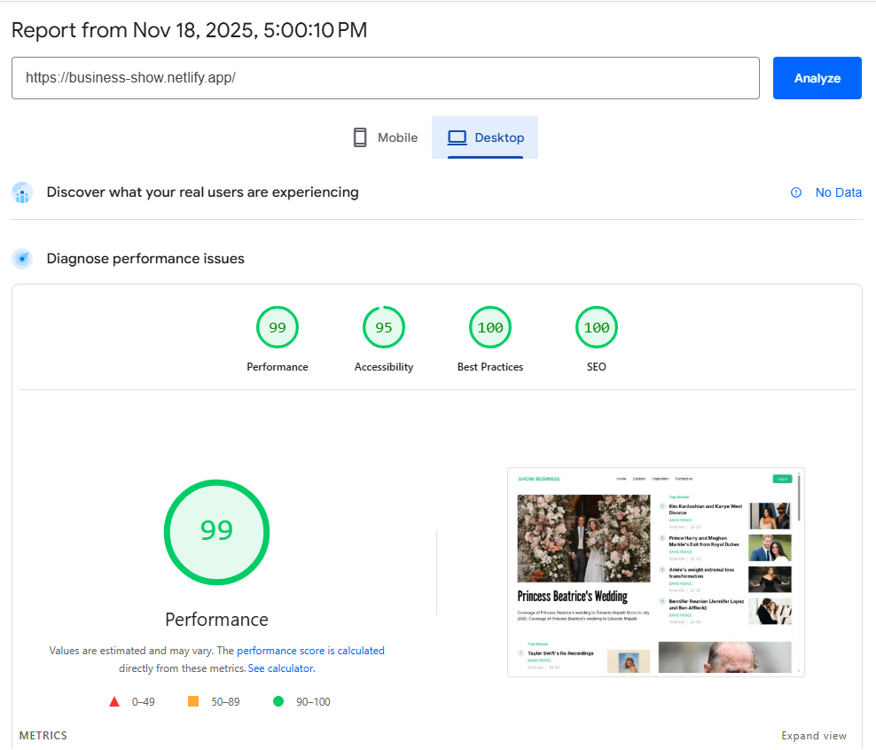
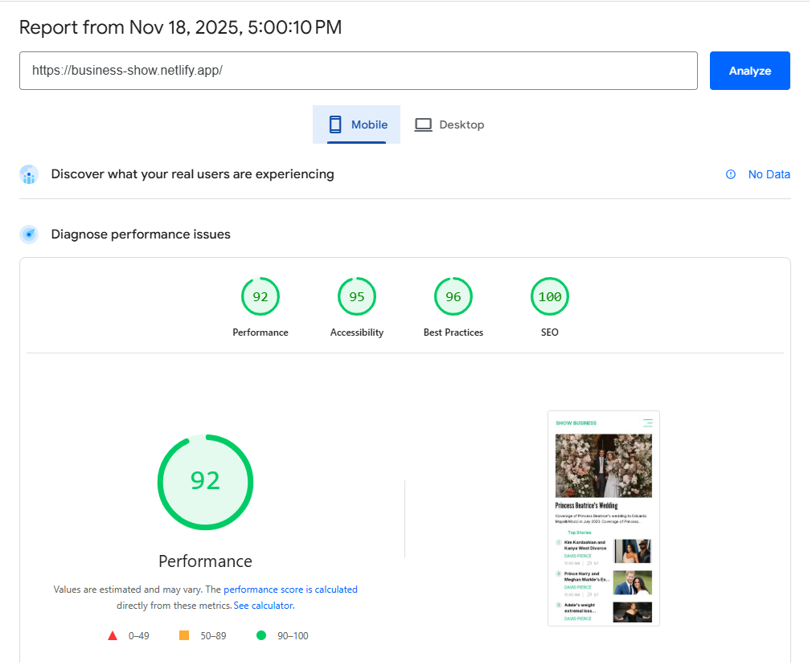
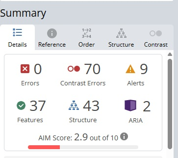
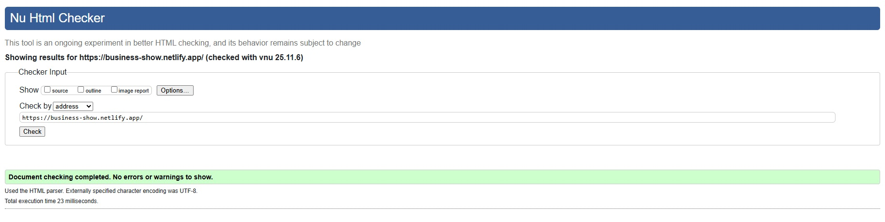

<a id="readme-top"></a>

<div align="center">
  <a href="https://github.com/othneildrew/Best-README-Template">
    
  </a>
  <h1 align="center">Show Business</h1>
</div>

<details>
  <summary><h2>Table of contents</h2></summary>
  <ol>
    <li>
      <a href="#about-project">About project</a>
      <ul>
        <li><a href="#description">Description</a></li>
        <li><a href="#-key-benefits">Key benefits</a></li>
        <li><a href="#technologies-used">Technologies Used</a></li>
        <li><a href="#project-architecture">Project architecture</a></li>
      </ul>
    </li>
    <li>
      <a href="#usage">Usage</a>
      <ul>
        <li><a href="#setup-instructions">Setup Instructions</a></li>
        <li><a href="#scripts-in-project">Scripts in project</a></li>
      </ul>
    </li>
    <li>
      <a href="#Performance">Performance</a>
    </li>
    <li>
      <a href="#the-following-people-were-involved-in-the-project">The following people were involved in the project</a>
    </li>
  </ol>
</details>

## About Project

DEPLOY: <a href="https://business-show.netlify.app/">Show Business</a>

### Description

This is a task 2 assignment for Innowise Group.
Reinforcing basic frontend development knowledge through hands-on practice by laying out a "show business" layout

### 🔥 Key Benefits

- 🧭 **Intuitive and friendly UI**
- ⚡ \*\*Fast loading
- 🛍️ **Added a lot feature, like a variables**

### Technologies Used

##### Main language

<ul>
  <li>
    <a href="https://javascript.info/">
         JavaScript
    </a>
  </li>
</ul>

##### Main frameworks and libraries

<ul>
  <li>
    <a href="https://sass-lang.com/">
   SCSS
    </a>
  </li>
</ul>


### Project architecture

The project is built as a simple static site without backend or frameworks. Key components:

- HTML Structure: The main file index.html contains the page markup. Includes semantic tags (header, main, footer) and components like news cards (img, h4, p with text truncation using ellipsis).
- styles: Contains global styling resources - including global styles, variables, mixins, normalize, and helper functions for consistent design across the project.
- script.js: Handles interactive elements, specifically the burger menu toggle.


<p align="right">(<a href="#readme-top">back to top</a>)</p>

## Usage

### Setup Instructions

1. Install Node.js (Node version >= v22.13.1)

```sh
npm install npm@latest -g
```

2. Obtain the Project Files: you have two options for obtaining the project files:

- Fork the Repository: If you plan to contribute to the project or make changes to the code, it's recommended to fork the repository. This will create a copy of the repository under your GitHub account. [Fork the repository](https://github.com/aQafresca/business_show/fork) to create a copy under your account.

- Download the Repository: If you only intend to use the project locally and don't plan to contribute changes, you can simply download the repository as a ZIP file. [Download the repository](https://github.com/aQafresca/business_show/archive/refs/heads/main.zip) as a ZIP file and extract it to your local machine.

3. Clone the Repository (if Forked): if you forked the repository, clone your newly created repo to your local machine using the following command:

```
git clone https://github.com/YOUR-USERNAME/business_show.git
```

4. Navigate to the Project Directory: once you have obtained the project files (either by forking or downloading), navigate to the project directory:

```
cd business_show
```

5. To install all dependencies use:

```
npm install
```

6. Run the Sass watcher to compile .scss files to .css automatically on changes:

```
npm run sass-watch
```
7. Open index.html directly in your web browser


<p align="right">(<a href="#readme-top">back to top</a>)</p>

### Scripts in project

1. `npm run sass-watch` - Compile .scss files to .css automatically on changes.


<p align="right">(<a href="#readme-top">back to top</a>)</p>

### Performance

1. Lighthouse

   
   

2. WAVE / Axe

   

3. W3C Validator

   


<p align="right">(<a href="#readme-top">back to top</a>)</p>

## The following people were involved in the project

### Authors

- [aQafresca](https://github.com/aQafresca)

<p align="right">(<a href="#readme-top">back to top</a>)</p>